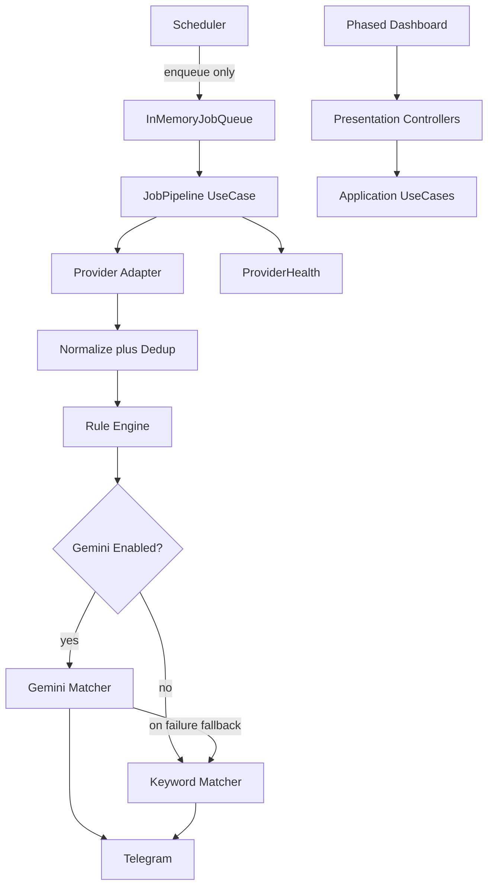

# Job Intelligence Platform — Revised Part-Wise Plan

Overrides [project.md](project.md) structure with mandatory DDD layering, optional AI, separated scheduler/pipeline, incremental providers, and phased UI. Monorepo: `backend/` + `frontend/`. No Redis/BullMQ/Docker/Postgres in V1.

### Part execution protocol (mandatory)

Implement **only** the part the user explicitly requests. Treat each part like a pull request, not a one-shot generation.

**Before writing any code for that part:**

1. Explain the design decisions.
2. Identify potential edge cases.
3. Explain why the approach follows SOLID and Clean Architecture.

**Then:** implement that part only → add tests → verify.

**After implementation:**

1. Summarize what was completed.
2. Suggest improvements.
3. List technical debt (if any).
4. **Stop and wait for approval** before starting the next part.

Do not auto-continue. Do not implement multiple parts in one pass.



---

## Backend layout (DDD)

```
backend/src/
  domain/
    entities/
    value-objects/
    repositories/      # interfaces only
    services/          # domain services (rules, dedup hash, etc.)
  application/
    usecases/          # JobPipeline, MatchJob, NotifyJob, RunCompanyFetch, ...
  infrastructure/
    database/          # Prisma client + repository implementations
    providers/         # Greenhouse, Lever, Workday, Microsoft adapters
    telegram/
    gemini/
    scheduler/         # node-cron only — enqueues work, no business logic
    queue/             # in-memory async processing queue (V1)
  presentation/
    controllers/
    routes/
    middleware/
  shared/
    types/
    utils/
    config/
```

- Controllers coordinate HTTP only.
- Use cases own orchestration.
- Repositories persist only.
- Business rules live in domain/application.

---

## Part 0 — Design & Scaffold

Explain design first, then scaffold empty shells.

- Document DDD boundaries + dependency direction (presentation → application → domain; infrastructure implements domain ports)
- Prisma schema draft including:
  - Core: `Company`, `Job`, `Rule`, `Application`, `NotificationLog`, `ProviderLog`
  - `Resume`: originalPdf (optional bytes/path), extractedText, markdown, embedding (nullable for future)
  - `PromptTemplate`: id, name, version, content, enabled
  - `ProviderHealth`: status, lastRun, lastSuccess, averageExecutionTime, failureCount, lastError
- `JobProvider` port in domain; adapters in infrastructure
- API contract map
- Frontend route map (phased; Dev Tools included)
- In-memory queue + pipeline sequence diagram

**Exit:** Design reviewed; empty folders + TS/Express/Vite/Prisma scaffold. Stop for review.

---

## Part 1 — Domain Core & Persistence

- Domain entities / value objects (`Job`, `MatchScore`, `DedupHash`, etc.)
- Repository interfaces + Prisma implementations
- Migrations for full V1 schema (including resume variants, prompts, provider health)
- Config via env (`DATABASE_URL`, `TELEGRAM_*`, `GEMINI_*`, `GEMINI_ENABLED`, thresholds)
- Seed default `PromptTemplate` rows (matching prompt v1)
- DI composition root wiring repositories/adapters
- `GET /api/health`

**Exit:** Migrations apply; domain + repos unit-testable. Stop for review.

---

## Part 2 — Pipeline Core (no ATS scrape yet)

Build the full processing path with a **stub/fake provider** so later provider parts only plug in adapters.

1. **Scheduler** — `node-cron` loads due companies and **only enqueues** `FetchCompanyJobs` jobs. No normalize/match/notify here.
2. **In-memory queue** — async worker invokes application use cases; failures isolated per item.
3. **Job Pipeline use case** — fetch → normalize → SHA256 dedup (`company+title+location`) → persist new jobs → rule engine → matching → notify.
4. **Rule engine** — configurable DB rules (countries, cities, experience, skills, role, excluded roles, companies, min score).
5. **Matching** — if `GEMINI_ENABLED` and healthy: versioned prompt from `PromptTemplate` + resume text/markdown → Gemini JSON. On disable or any Gemini failure: log, **keyword matching fallback**, continue. Never block notifications.
6. **Telegram** — notify when score ≥ threshold; `NotificationLog`; no re-notify.
7. **Provider health** — update metrics after every run; expose `GET /api/providers/health`.

**Exit:** Stub provider through pipeline to Telegram (or dry-run). Integration test of pipeline with fake provider. Stop for review.

---

## Part 3A — Greenhouse Provider (first real ATS)

Complete independently before any other provider:

- Implement `GreenhouseProvider`
- Wire into registry for Greenhouse companies
- Normalize → DB → dedup → rules → AI/keyword → Telegram
- Update provider health
- Integration tests covering: fetch, normalize, deduplicate, rule engine, AI matching (mocked), notification (mocked), DB persistence
- Commit when green

**Exit:** Greenhouse fully working E2E. **Stop for review. Do not start 3B until approved.**

---

## Part 3B — Lever Provider

Same checklist as 3A for Lever only. No Workday/Microsoft yet.

**Exit:** Lever green + commit. Stop for review.

---

## Part 3C — Workday Provider

Same checklist; Playwright/Cheerio as required for Workday. Isolated failures must not affect other providers.

**Exit:** Workday green + commit. Stop for review.

---

## Part 3D — Microsoft Provider

Same checklist for Microsoft careers adapter.

**Exit:** All four V1 providers independently proven. Stop for review.

---

## Part 4 — Developer Tools (backend + UI page)

Internal/dev-only page and APIs:

- Run Provider / Run Scheduler
- Test Telegram / Test Gemini
- View raw provider response, normalized job, rule evaluation, AI output
- Clear Database / Clear Logs / Export Logs

Gate behind `NODE_ENV !== production` or explicit `ENABLE_DEV_TOOLS=true`.

**Exit:** Can debug full pipeline without waiting for cron. Stop for review.

---

## Part 5 — Dashboard UI Phase 1

- **Jobs** — list, filters, match score, apply URL
- **Companies** — list/add/enable/frequency/provider

TanStack Query + Tailwind. No other pages yet.

**Exit:** Manage companies and inspect jobs in UI. Stop for review.

---

## Part 6 — Dashboard UI Phase 2

- **Provider Health** — status, lastRun, lastSuccess, avg time, failureCount, lastError
- **Logs** — ProviderLog + NotificationLog

**Exit:** Ops visibility in UI. Stop for review.

---

## Part 7 — Dashboard UI Phase 3

- **Rules** — CRUD for rule engine config
- **Applications** — Saved → Applied → Interview → Rejected → Offer → Joined

**Exit:** Rules and application tracker usable. Stop for review.

---

## Part 8 — Dashboard UI Phase 4 + Polish ✅

- **Settings** — resume (PDF upload + text/markdown), prompt templates, thresholds, Gemini enable flag (keys server-side only)
- **Analytics** — companies monitored, jobs checked today, matched, notifications, applied, ignored
- Error middleware, frontend error boundaries, strict TS, README architecture, lint/`tsc` GitHub Action
- Smoke checklist documented

**Out of V1:** Email/push, resume tailor, cover letter, interview prep, referral tracker, daily digest, SuccessFactors/Oracle/Custom, real embeddings (schema field only).

---

## Matching & notification pipeline (canonical)

```
New Job → Rule Engine → Gemini enabled? → Gemini Matching
                              ↓ no / fail
                        Keyword Matching → Notification (if score ≥ threshold)
```

Gemini never crashes the worker; failures are logged and processing continues.

---

## Per-provider definition of done

For each of 3A–3D:

1. Adapter implements `JobProvider`
2. Normalize to domain `Job`
3. Persist + dedup
4. Rule engine
5. AI matching if enabled (else keyword)
6. Telegram when eligible
7. Provider health updated
8. Integration tests for fetch, normalize, dedup, rules, AI, notification, persistence
9. Commit
10. Wait for review before next provider

---

## Coding standards (enforced every part)

Strict TypeScript, no `any`, SOLID, DRY, KISS, DI, repository + adapter patterns, typed errors, comprehensive logging, small reusable services.

## Success criteria

Easy to add ATS providers, maintain, debug, and test — portfolio-quality senior backend architecture over feature count.
